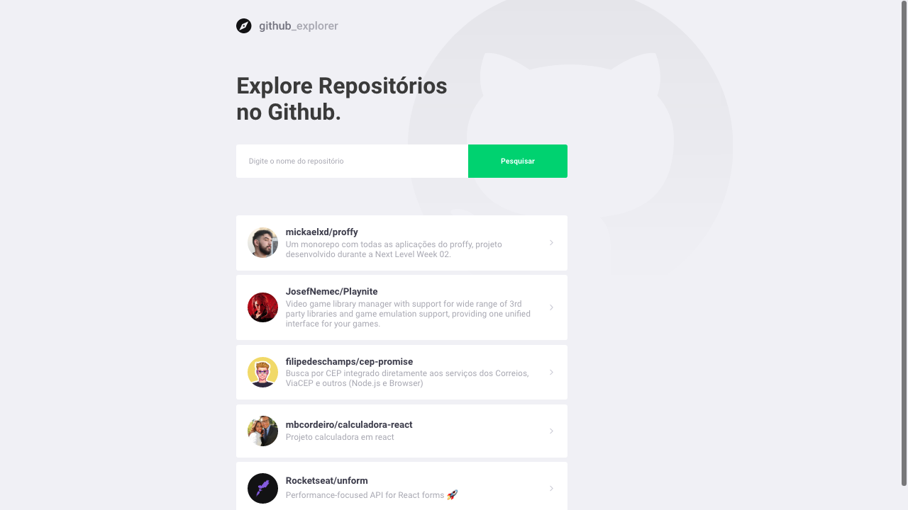

# Github Explorer

Projeto desenvolvido durante o Bootcamp da Rocketseat.
Esse projeto tem como objetivo a criação de uma aplicação
React utilizando Typescript.

## Tecnologias Utilizadas

- React
- React-Router-Dom
- Styled Components
- Typescript
- Axios (Rest API)

## Screenshot



## Para utilizar essa aplicação

Caso queira testar em sua máquina, você deve possuir o nodeJS na versão 12 ou posterior.

Basta clonar o repositório:
```sh
git clone https://github.com/mickaelxd/github-explorer.git
```

E dentro da pasta rodar o comando de instalação de pacotes, e depois iniciar:

```sh
yarn && yarn start
## ou
npm i && npm run start
```

Obrigado por ler até aqui!
